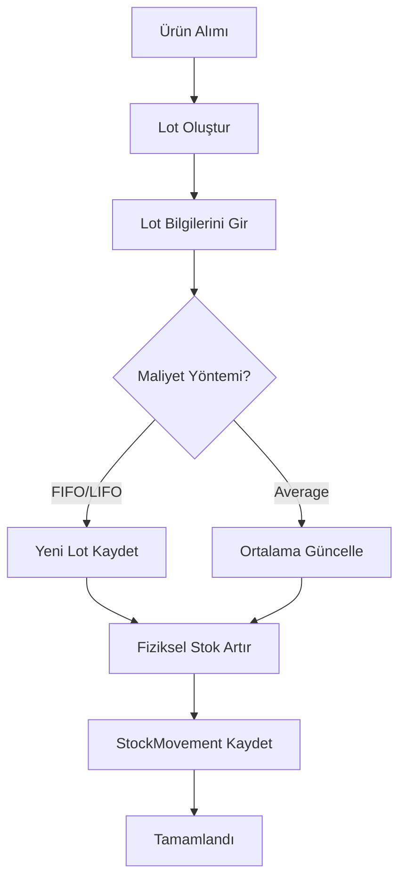
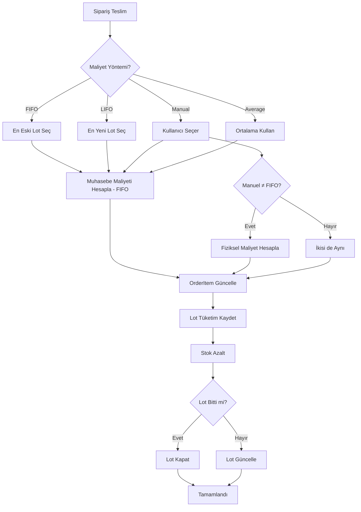
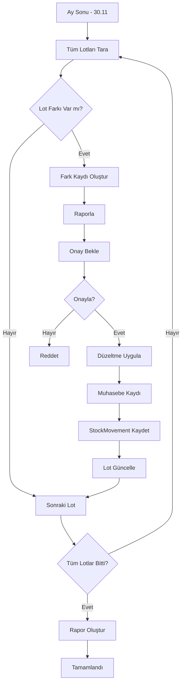

# Hibrit Maliyet Sistemi - Teknik Tasarım Dökümanı

## 📋 İçindekiler
1. Sistem Mimarisi
2. Veri Yapıları
3. İş Akışları
4. API Fonksiyonları
5. UI Bileşenleri
6. Geriye Dönük Uyumluluk
7. Implementasyon Planı

---

## 1. SİSTEM MİMARİSİ

### 1.1 Katmanlar

```
┌────────────────────────────────────────────────┐
│  KATMAN 1: FİZİKSEL STOK (Physical Layer)     │
│  - Lot bazlı takip                              │
│  - Gerçek depo hareketleri                      │
│  - SKT, kalite, lokasyon bilgisi               │
└────────────────────────────────────────────────┘
                    ↓
┌────────────────────────────────────────────────┐
│  KATMAN 2: MUHASEBE STOK (Accounting Layer)   │
│  - FIFO/LIFO/Average hesaplama                 │
│  - Vergi mevzuatına uygun                      │
│  - Standart maliyet takibi                     │
└────────────────────────────────────────────────┘
                    ↓
┌────────────────────────────────────────────────┐
│  KATMAN 3: UZLAŞTIRMA (Reconciliation Layer)  │
│  - Fark analizi                                 │
│  - Otomatik/Manuel düzeltme                    │
│  - Raporlama                                   │
└────────────────────────────────────────────────┘
```

### 1.2 Veri Akışı

**Stok Girişi:**
```
Satın Alma → Lot Oluştur → Fiziksel Stok+ → Muhasebe Stok+ (FIFO)
```

**Stok Çıkışı (Satış):**
```
Sipariş → Sevkiyat → Lot Seçimi (Manuel/Auto) → Fiziksel Stok-
                                               ↓
                                    Muhasebe Stok- (FIFO)
                                               ↓
                                    Fark Tespit → Kayıt
```

**Uzlaştırma:**
```
Periyodik (Ay Sonu) → Farkları Topla → Düzeltme Öner → Onayla → Uygula
```

---

## 2. VERİ YAPILARI

### 2.1 Yeni Tip Tanımları

#### **StockLot Interface** (Fiziksel Stok - LOT Bazlı)

```typescript
// src/types/costing.ts (YENİ DOSYA)

export interface StockLot {
  // Temel Bilgiler
  id: string;
  productId: string;
  productName: string;          // Denormalized
  productUnit: string;           // Denormalized

  // Lot Bilgileri
  lotNumber: string;             // "LOT-2024-11-22-001"
  purchaseDate: string;          // "2024-11-22" (YYYY-MM-DD)
  purchaseReference?: string;    // "FT-2024-1234" (Fatura no)
  supplierName?: string;         // "ABC Çelik Ltd."
  invoiceNumber?: string;        // "FT-001"

  // Miktar Bilgileri
  initialQuantity: number;       // Başlangıç: 500 kg
  remainingQuantity: number;     // Kalan: 350 kg
  consumedQuantity: number;      // Kullanılan: 150 kg

  // Maliyet Bilgileri
  unitCost: number;              // Birim maliyet: 35.50 TL/kg
  totalCost: number;             // Toplam: 17,750 TL
  currency: Currency;            // 'TRY' | 'USD'
  exchangeRate?: number;         // Dolar kuru (USD için)

  // Kalite & Lokasyon (Opsiyonel)
  batchNumber?: string;          // Üretici parti numarası
  expiryDate?: string;           // Son kullanma tarihi (gıda için)
  qualityGrade?: string;         // "A", "B", "C" kalite sınıfı
  warehouseLocation?: string;    // "Depo-A / Raf-12"

  // Durum
  status: 'active' | 'consumed' | 'expired' | 'returned';
  isConsumed: boolean;           // Tamamen tükendi mi?
  consumedAt?: string;           // Tükenme tarihi

  // Notlar
  notes?: string;

  // Metadata
  createdBy: string;
  createdByEmail: string;
  createdAt: Timestamp;
  updatedAt?: Timestamp;
}
```

#### **LotConsumption Interface** (Lot Tüketim Kaydı)

```typescript
export interface LotConsumption {
  id: string;
  lotId: string;
  lotNumber: string;             // Denormalized

  // İlişkili Kayıtlar
  orderId: string;
  orderNumber?: string;
  shipmentId?: string;

  // Tüketim Bilgileri
  quantityUsed: number;          // Bu lottan kullanılan: 150 kg
  unitCost: number;              // O anki birim maliyet: 35.50
  totalCost: number;             // Toplam maliyet: 5,325 TL

  // Tüketim Tipi
  consumptionType: 'fifo' | 'lifo' | 'manual' | 'average';

  // Tarih
  consumptionDate: string;       // "2024-11-25"

  // Metadata
  createdBy: string;
  createdByEmail: string;
  createdAt: Timestamp;
}
```

#### **Güncellenmiş OrderItem Interface**

```typescript
// src/types/index.ts - GÜNCELLENMİŞ
export interface OrderItem {
  // MEVCUT ALANLAR
  productId: string;
  productName?: string;
  quantity: number;
  unit_price: number;
  unit?: string;
  total?: number;

  // YENİ ALANLAR - MALİYET TAKİBİ

  // MUHASEBE MALİYETİ (FIFO'ya göre)
  accountingCost?: number;           // FIFO toplam maliyeti: 7,000 TL
  accountingCostPerUnit?: number;    // FIFO birim maliyet: 35 TL/kg
  accountingLotConsumptions?: LotConsumption[];  // FIFO'ya göre hangi lotlar

  // FİZİKSEL MALİYET (Gerçek)
  physicalCost?: number;             // Gerçek maliyet: 7,200 TL
  physicalCostPerUnit?: number;      // Gerçek birim maliyet: 36 TL/kg
  physicalLotConsumptions?: LotConsumption[];    // Gerçekte kullanılan lotlar

  // FARK ANALİZİ
  costVariance?: number;             // Fark: 200 TL (fiziksel - muhasebe)
  costVariancePercentage?: number;   // Fark %: 2.86%
  varianceReason?: string;           // "Manuel lot seçimi - LIFO kullanıldı"
  hasCostVariance?: boolean;         // FIFO ihlali var mı?

  // LOT SEÇİM YÖNTEMİ
  lotSelectionMethod?: 'auto-fifo' | 'auto-lifo' | 'manual' | 'average';
  manualLotSelectionApprovedBy?: string;  // Onaylayan kişi

  // KULLANICI NOTLARI
  costingNotes?: string;             // "Depoda ön taraftan alındı"
}
```

#### **LotReconciliation Interface** (Uzlaştırma)

```typescript
export interface LotReconciliation {
  id: string;

  // Dönem
  period: string;                    // "2024-11" (YYYY-MM)
  periodStart: string;               // "2024-11-01"
  periodEnd: string;                 // "2024-11-30"

  // Ürün
  productId: string;
  productName: string;               // Denormalized

  // LOT Bilgileri
  lotId: string;
  lotNumber: string;

  // FARKLAR
  accountingBalance: number;         // Muhasebe stoğu: 300 kg
  physicalBalance: number;           // Fiziksel stok: 500 kg
  variance: number;                  // Fark: +200 kg
  varianceValue: number;             // Değer farkı: +7,000 TL

  // DURUM
  status: 'pending' | 'approved' | 'adjusted' | 'rejected';
  adjustmentNeeded: boolean;

  // DÜZELTME
  adjustmentType?: 'accounting-to-physical' | 'physical-to-accounting';
  adjustmentDate?: string;
  adjustedBy?: string;
  adjustedByEmail?: string;
  adjustmentNotes?: string;

  // ONAY
  approvedBy?: string;
  approvedByEmail?: string;
  approvedAt?: string;

  // Metadata
  createdBy: string;
  createdByEmail: string;
  createdAt: Timestamp;
  updatedAt?: Timestamp;
}
```

#### **CostingConfig Interface** (Ürün Bazlı Ayarlar)

```typescript
// Product interface'ine eklenecek alanlar
export interface Product {
  // ... MEVCUT ALANLAR ...

  // YENİ MALİYET AYARLARI
  costingMethod?: 'fifo' | 'lifo' | 'average' | 'manual';  // Varsayılan yöntem
  allowManualLotSelection?: boolean;     // Satışta manuel lot seçimi yapılabilir mi?
  requireLotApproval?: boolean;          // FIFO ihlali onay gerektiriyor mu?
  lotTrackingEnabled?: boolean;          // Lot takibi aktif mi?

  // AĞIRLIKLI ORTALAMA (Average method için)
  averageCost?: number;                  // Ağırlıklı ortalama maliyet
  totalStockValue?: number;              // Toplam stok değeri

  // COST HISTORY
  costHistory?: CostHistoryEntry[];      // Son 12 ayın maliyet geçmişi
}

export interface CostHistoryEntry {
  date: string;                          // "2024-11-01"
  averageCost: number;                   // O andaki ortalama: 35.25
  stockQuantity: number;                 // O andaki stok: 850
  method: 'fifo' | 'lifo' | 'average';
  reason: 'purchase' | 'sale' | 'adjustment' | 'reconciliation';
  notes?: string;
}
```

---

## 3. İŞ AKIŞLARI

### 3.1 Stok Girişi (Alım)



**Kod Akışı:**
```javascript
// 1. Lot oluştur
const lot = await createStockLot({
  productId: 'product-123',
  lotNumber: generateLotNumber(), // "LOT-2024-11-22-001"
  purchaseDate: '2024-11-22',
  initialQuantity: 500,
  unitCost: 35.50,
  totalCost: 17750,
  currency: 'TRY',
  supplierName: 'ABC Çelik',
  invoiceNumber: 'FT-001'
});

// 2. Fiziksel stok artır
await updateProductStock(productId, +500);

// 3. Average method ise ortalama güncelle
if (product.costingMethod === 'average') {
  const newAverage = calculateWeightedAverage(
    product.stock_quantity,
    product.average_cost,
    500,  // yeni miktar
    35.50 // yeni maliyet
  );

  await updateProduct(productId, {
    average_cost: newAverage.averageCost,
    total_stock_value: newAverage.totalValue
  });
}

// 4. StockMovement kaydet
await logStockMovement({
  type: 'Manuel Giriş',
  quantity: 500,
  unitCost: 35.50,
  totalCost: 17750,
  lotId: lot.id,
  lotNumber: lot.lotNumber
});
```

### 3.2 Satış & Sevkiyat (LOT Tüketimi)



**Kod Akışı - Detaylı:**

```javascript
// ADIM 1: Muhasebe Maliyeti (FIFO)
const accountingCost = await calculateAccountingCost(
  productId,
  quantity,
  'fifo'
);

// Sonuç:
// {
//   totalCost: 7000,
//   costPerUnit: 35,
//   lotConsumptions: [
//     { lotId: 'LOT-A', qty: 200, unitCost: 35, total: 7000 }
//   ]
// }

// ADIM 2: Kullanıcıya Lot Seçimi Göster (Opsiyonel)
if (product.allowManualLotSelection) {
  const availableLots = await getAvailableLots(productId);

  // UI'da göster:
  // - LOT-A: 500 kg @ 35 TL (22.11.2024) [ÖNERİLEN - FIFO]
  // - LOT-B: 300 kg @ 36 TL (25.11.2024)

  const userSelection = await showLotSelectionDialog({
    quantity: 200,
    suggestedLots: accountingCost.lotConsumptions,
    availableLots: availableLots
  });
}

// ADIM 3: Fiziksel Maliyet (Kullanıcı seçimi veya FIFO)
let physicalCost;
let hasCostVariance = false;

if (userSelection && userSelection !== accountingCost) {
  // Kullanıcı farklı lot seçti
  physicalCost = calculateCostFromLots(userSelection);
  hasCostVariance = true;

  // Onay gerekiyor mu?
  if (product.requireLotApproval && hasCostVariance) {
    await requestApproval({
      type: 'LOT_VARIANCE',
      orderId: order.id,
      accountingCost: accountingCost.totalCost,
      physicalCost: physicalCost.totalCost,
      variance: physicalCost.totalCost - accountingCost.totalCost,
      reason: userSelection.reason
    });
  }
} else {
  // FIFO kullanıldı, fark yok
  physicalCost = accountingCost;
}

// ADIM 4: OrderItem Güncelle
await updateOrderItem(orderId, itemId, {
  // Muhasebe
  accountingCost: accountingCost.totalCost,
  accountingCostPerUnit: accountingCost.costPerUnit,
  accountingLotConsumptions: accountingCost.lotConsumptions,

  // Fiziksel
  physicalCost: physicalCost.totalCost,
  physicalCostPerUnit: physicalCost.costPerUnit,
  physicalLotConsumptions: physicalCost.lotConsumptions,

  // Fark
  hasCostVariance: hasCostVariance,
  costVariance: physicalCost.totalCost - accountingCost.totalCost,
  costVariancePercentage:
    ((physicalCost.totalCost - accountingCost.totalCost) / accountingCost.totalCost) * 100,

  // Yöntem
  lotSelectionMethod: userSelection ? 'manual' : 'auto-fifo'
});

// ADIM 5: Lot Tüketim Kayıtları Oluştur
for (const consumption of physicalCost.lotConsumptions) {
  await createLotConsumption({
    lotId: consumption.lotId,
    orderId: order.id,
    quantityUsed: consumption.quantity,
    unitCost: consumption.unitCost,
    totalCost: consumption.totalCost,
    consumptionType: userSelection ? 'manual' : 'fifo'
  });

  // Lot'u güncelle
  await updateLot(consumption.lotId, {
    remainingQuantity: lot.remainingQuantity - consumption.quantity,
    consumedQuantity: lot.consumedQuantity + consumption.quantity,
    isConsumed: lot.remainingQuantity - consumption.quantity === 0
  });
}

// ADIM 6: Fiziksel Stok Azalt
await updateProductStock(productId, -quantity);

// ADIM 7: StockMovement Kaydet
await logStockMovement({
  type: 'Sevkiyat',
  quantity: -quantity,
  relatedId: order.id,
  relatedType: 'order',
  // Fiziksel maliyeti kaydet
  unitCost: physicalCost.costPerUnit,
  totalCost: physicalCost.totalCost,
  lotConsumptions: physicalCost.lotConsumptions
});
```

### 3.3 Ay Sonu Uzlaştırma



**Kod Akışı:**
```javascript
// 1. Uzlaştırma başlat
async function runMonthlyReconciliation(period = '2024-11') {
  const periodStart = `${period}-01`;
  const periodEnd = `${period}-30`;

  // Tüm aktif ürünleri al
  const products = await getActiveProducts();
  const reconciliations = [];

  for (const product of products) {
    if (!product.lotTrackingEnabled) continue;

    // Ürünün tüm lotlarını al
    const lots = await getProductLots(product.id);

    for (const lot of lots) {
      // Muhasebe bakiyesi (FIFO'ya göre olması gereken)
      const accountingBalance = await calculateAccountingBalance(
        lot.id,
        periodEnd
      );

      // Fiziksel bakiye (Gerçek)
      const physicalBalance = lot.remainingQuantity;

      // Fark var mı?
      const variance = physicalBalance - accountingBalance;

      if (Math.abs(variance) > 0.01) { // 10 gram tolerans
        const reconciliation = await createReconciliation({
          period,
          periodStart,
          periodEnd,
          productId: product.id,
          productName: product.name,
          lotId: lot.id,
          lotNumber: lot.lotNumber,
          accountingBalance,
          physicalBalance,
          variance,
          varianceValue: variance * lot.unitCost,
          status: 'pending',
          adjustmentNeeded: true
        });

        reconciliations.push(reconciliation);
      }
    }
  }

  return reconciliations;
}

// 2. Düzeltme uygula
async function applyReconciliationAdjustment(reconciliationId, approvedBy) {
  const recon = await getReconciliation(reconciliationId);

  // Onay kontrolü
  if (!approvedBy) {
    throw new Error('Reconciliation must be approved');
  }

  // Düzeltme yöntemi belirle
  // Genelde fiziksel gerçeği muhasebe kaydına aktarırız
  const adjustmentType = 'accounting-to-physical';

  // Muhasebe kaydını fiziksel ile eşitle
  // (Bu bir "phantom" consumption oluşturur)
  await createPhantomConsumption({
    lotId: recon.lotId,
    quantityAdjustment: recon.variance,
    reason: 'Monthly reconciliation adjustment',
    reconciliationId: recon.id,
    approvedBy,
    notes: `Accounting balance adjusted from ${recon.accountingBalance} to ${recon.physicalBalance}`
  });

  // Reconciliation kaydını güncelle
  await updateReconciliation(recon.id, {
    status: 'adjusted',
    adjustmentType,
    adjustmentDate: new Date().toISOString(),
    adjustedBy: approvedBy,
    approvedBy: approvedBy,
    approvedAt: new Date().toISOString()
  });

  // StockMovement kaydet
  await logStockMovement({
    type: 'Sayım Düzeltmesi',
    quantity: recon.variance,
    relatedId: recon.id,
    relatedType: 'reconciliation',
    notes: `Lot uzlaştırma düzeltmesi: ${recon.lotNumber}`,
    unitCost: 0, // Maliyet değişmedi, sadece miktar
    totalCost: 0
  });
}
```

---

## 4. API FONKSİYONLARI

### 4.1 Lot Yönetimi

```javascript
// services/lotService.js (YENİ DOSYA)

/**
 * Yeni lot oluştur
 */
export async function createStockLot(userId, lotData) {
  const lotRef = doc(collection(db, `users/${userId}/stock_lots`));

  const lot = {
    id: lotRef.id,
    ...lotData,
    remainingQuantity: lotData.initialQuantity,
    consumedQuantity: 0,
    status: 'active',
    isConsumed: false,
    createdAt: new Date().toISOString()
  };

  await setDoc(lotRef, lot);
  return lot;
}

/**
 * Aktif lotları getir (FIFO sıralı)
 */
export async function getAvailableLots(userId, productId, sortMethod = 'fifo') {
  const lotsRef = collection(db, `users/${userId}/stock_lots`);
  const q = query(
    lotsRef,
    where('productId', '==', productId),
    where('status', '==', 'active'),
    where('remainingQuantity', '>', 0)
  );

  const snapshot = await getDocs(q);
  const lots = snapshot.docs.map(doc => doc.data());

  // Sırala
  if (sortMethod === 'fifo') {
    lots.sort((a, b) => new Date(a.purchaseDate) - new Date(b.purchaseDate));
  } else if (sortMethod === 'lifo') {
    lots.sort((a, b) => new Date(b.purchaseDate) - new Date(a.purchaseDate));
  }

  return lots;
}

/**
 * FIFO'ya göre maliyet hesapla
 */
export async function calculateFIFOCost(userId, productId, quantityNeeded) {
  const lots = await getAvailableLots(userId, productId, 'fifo');

  let remaining = quantityNeeded;
  let totalCost = 0;
  const consumptions = [];

  for (const lot of lots) {
    if (remaining <= 0) break;

    const qtyFromLot = Math.min(remaining, lot.remainingQuantity);
    const costFromLot = qtyFromLot * lot.unitCost;

    consumptions.push({
      lotId: lot.id,
      lotNumber: lot.lotNumber,
      quantity: qtyFromLot,
      unitCost: lot.unitCost,
      totalCost: costFromLot,
      purchaseDate: lot.purchaseDate
    });

    totalCost += costFromLot;
    remaining -= qtyFromLot;
  }

  if (remaining > 0) {
    throw new Error(`Insufficient stock: ${remaining} ${product.unit} short`);
  }

  return {
    totalCost,
    costPerUnit: totalCost / quantityNeeded,
    lotConsumptions: consumptions
  };
}

/**
 * Lot'ları tüket
 */
export async function consumeLots(userId, orderId, consumptions) {
  const batch = [];

  for (const consumption of consumptions) {
    // 1. LotConsumption kaydı oluştur
    const consumptionRef = doc(collection(db, `users/${userId}/lot_consumptions`));
    batch.push(setDoc(consumptionRef, {
      id: consumptionRef.id,
      ...consumption,
      orderId,
      createdAt: new Date().toISOString()
    }));

    // 2. Lot'u güncelle
    const lotRef = doc(db, `users/${userId}/stock_lots`, consumption.lotId);
    const lot = await getDoc(lotRef);
    const lotData = lot.data();

    const newRemaining = lotData.remainingQuantity - consumption.quantity;
    const newConsumed = lotData.consumedQuantity + consumption.quantity;

    batch.push(updateDoc(lotRef, {
      remainingQuantity: newRemaining,
      consumedQuantity: newConsumed,
      isConsumed: newRemaining === 0,
      consumedAt: newRemaining === 0 ? new Date().toISOString() : null,
      status: newRemaining === 0 ? 'consumed' : 'active',
      updatedAt: new Date().toISOString()
    }));
  }

  // Tüm işlemleri yap
  await Promise.all(batch);
}
```

### 4.2 Uzlaştırma

```javascript
// services/reconciliationService.js (YENİ DOSYA)

/**
 * Ay sonu uzlaştırma çalıştır
 */
export async function runMonthlyReconciliation(userId, period) {
  // ... (yukarıda detaylandırıldı)
}

/**
 * Uzlaştırma düzeltmesi uygula
 */
export async function applyReconciliationAdjustment(userId, reconciliationId, approvedBy) {
  // ... (yukarıda detaylandırıldı)
}

/**
 * Uzlaştırma raporu oluştur
 */
export async function generateReconciliationReport(userId, period) {
  const reconciliations = await getReconciliationsByPeriod(userId, period);

  const summary = {
    period,
    totalReconciliations: reconciliations.length,
    totalVarianceValue: reconciliations.reduce((sum, r) => sum + Math.abs(r.varianceValue), 0),
    pendingCount: reconciliations.filter(r => r.status === 'pending').length,
    approvedCount: reconciliations.filter(r => r.status === 'approved').length,
    adjustedCount: reconciliations.filter(r => r.status === 'adjusted').length,
    byProduct: {}
  };

  // Ürün bazlı grupla
  for (const recon of reconciliations) {
    if (!summary.byProduct[recon.productId]) {
      summary.byProduct[recon.productId] = {
        productName: recon.productName,
        variances: [],
        totalVariance: 0,
        totalVarianceValue: 0
      };
    }

    summary.byProduct[recon.productId].variances.push(recon);
    summary.byProduct[recon.productId].totalVariance += recon.variance;
    summary.byProduct[recon.productId].totalVarianceValue += Math.abs(recon.varianceValue);
  }

  return summary;
}
```

---

## 5. UI BİLEŞENLERİ

### 5.1 Lot Seçim Dialogu (Satış Sırasında)

```typescript
// components/costing/LotSelectionDialog.tsx (YENİ DOSYA)

interface LotSelectionDialogProps {
  isOpen: boolean;
  productId: string;
  productName: string;
  quantityNeeded: number;
  unit: string;
  suggestedLots: LotConsumption[];  // FIFO önerisi
  availableLots: StockLot[];
  onConfirm: (selectedLots: LotConsumption[], notes?: string) => void;
  onCancel: () => void;
}

const LotSelectionDialog: React.FC<LotSelectionDialogProps> = ({
  isOpen,
  productName,
  quantityNeeded,
  unit,
  suggestedLots,
  availableLots,
  onConfirm,
  onCancel
}) => {
  const [selectedLots, setSelectedLots] = useState<LotConsumption[]>(suggestedLots);
  const [selectionMethod, setSelectionMethod] = useState<'auto-fifo' | 'manual'>('auto-fifo');
  const [notes, setNotes] = useState('');

  // Seçilen miktarı hesapla
  const selectedQuantity = selectedLots.reduce((sum, lot) => sum + lot.quantity, 0);
  const selectedCost = selectedLots.reduce((sum, lot) => sum + lot.totalCost, 0);

  // FIFO maliyeti
  const fifoSelected Cost = suggestedLots.reduce((sum, lot) => sum + lot.totalCost, 0);

  // Fark var mı?
  const hasCostVariance = selectedCost !== fifoSelectedCost;
  const costVariance = selectedCost - fifoSelectedCost;

  return (
    <Modal isOpen={isOpen} onClose={onCancel} size="large">
      <div className="p-6">
        <h2 className="text-2xl font-bold mb-4">
          Lot Seçimi - {productName}
        </h2>

        <div className="bg-blue-50 p-4 rounded-lg mb-4">
          <p className="text-sm">
            <strong>Çıkış Miktarı:</strong> {quantityNeeded} {unit}
          </p>
        </div>

        {/* Yöntem Seçimi */}
        <div className="mb-4">
          <label className="block text-sm font-medium mb-2">
            Lot Seçim Yöntemi
          </label>
          <select
            value={selectionMethod}
            onChange={(e) => {
              setSelectionMethod(e.target.value as any);
              if (e.target.value === 'auto-fifo') {
                setSelectedLots(suggestedLots);
              }
            }}
            className="w-full px-3 py-2 border rounded"
          >
            <option value="auto-fifo">🤖 Otomatik (FIFO - İlk Giren İlk Çıkar)</option>
            <option value="manual">✋ Manuel Seçim</option>
          </select>
        </div>

        {/* FIFO Önerisi */}
        {selectionMethod === 'manual' && (
          <div className="mb-4 p-4 bg-green-50 border border-green-200 rounded">
            <h3 className="font-semibold text-green-800 mb-2">
              ✅ FIFO Önerisi (Muhasebe Standardı)
            </h3>
            <div className="space-y-1 text-sm">
              {suggestedLots.map((lot) => (
                <div key={lot.lotId} className="flex justify-between">
                  <span>{lot.lotNumber}: {lot.quantity} {unit} @ {formatCurrency(lot.unitCost)}</span>
                  <span className="font-semibold">{formatCurrency(lot.totalCost)}</span>
                </div>
              ))}
              <div className="border-t pt-1 mt-2 flex justify-between font-bold">
                <span>Toplam Maliyet:</span>
                <span>{formatCurrency(fifoSelectedCost)}</span>
              </div>
            </div>
          </div>
        )}

        {/* Lot Listesi */}
        <div className="mb-4">
          <h3 className="font-semibold mb-2">Mevcut Lotlar</h3>
          <div className="space-y-2">
            {availableLots.map((lot) => (
              <LotCard
                key={lot.id}
                lot={lot}
                isSelected={selectedLots.some(s => s.lotId === lot.id)}
                isFifoRecommended={suggestedLots.some(s => s.lotId === lot.id)}
                selectedQuantity={selectedLots.find(s => s.lotId === lot.id)?.quantity || 0}
                onSelect={(quantity) => handleLotSelect(lot, quantity)}
                disabled={selectionMethod === 'auto-fifo'}
              />
            ))}
          </div>
        </div>

        {/* Fark Uyarısı */}
        {hasCostVariance && (
          <div className="mb-4 p-4 bg-yellow-50 border border-yellow-200 rounded">
            <h3 className="font-semibold text-yellow-800 mb-2">
              ⚠️ Maliyet Farkı Tespit Edildi
            </h3>
            <div className="text-sm space-y-1">
              <p>FIFO Maliyeti: {formatCurrency(fifoSelectedCost)}</p>
              <p>Seçilen Maliyet: {formatCurrency(selectedCost)}</p>
              <p className={`font-bold ${costVariance > 0 ? 'text-red-600' : 'text-green-600'}`}>
                Fark: {costVariance > 0 ? '+' : ''}{formatCurrency(costVariance)}
                ({((costVariance / fifoSelectedCost) * 100).toFixed(2)}%)
              </p>
            </div>

            {/* Not Alanı */}
            <div className="mt-3">
              <label className="block text-sm font-medium mb-1">
                Sebep Açıklaması (Zorunlu)
              </label>
              <textarea
                value={notes}
                onChange={(e) => setNotes(e.target.value)}
                className="w-full px-3 py-2 border rounded"
                rows={2}
                placeholder="Örn: Depoda ön rafta olan yeni stok kullanıldı"
                required
              />
            </div>
          </div>
        )}

        {/* Özet */}
        <div className="bg-gray-50 p-4 rounded mb-4">
          <div className="grid grid-cols-2 gap-2 text-sm">
            <div>
              <p className="text-gray-600">Seçilen Miktar:</p>
              <p className="font-bold">{selectedQuantity} / {quantityNeeded} {unit}</p>
            </div>
            <div>
              <p className="text-gray-600">Toplam Maliyet:</p>
              <p className="font-bold">{formatCurrency(selectedCost)}</p>
            </div>
          </div>
        </div>

        {/* Butonlar */}
        <div className="flex gap-3">
          <button
            onClick={onCancel}
            className="px-4 py-2 border rounded hover:bg-gray-50"
          >
            İptal
          </button>
          <button
            onClick={() => onConfirm(selectedLots, notes)}
            disabled={selectedQuantity !== quantityNeeded || (hasCostVariance && !notes)}
            className="flex-1 px-4 py-2 bg-blue-500 text-white rounded hover:bg-blue-600 disabled:opacity-50 disabled:cursor-not-allowed"
          >
            {hasCostVariance ? '⚠️ Farkla Onayla' : 'Onayla'}
          </button>
        </div>
      </div>
    </Modal>
  );
};
```

### 5.2 Uzlaştırma Raporu Sayfası

```typescript
// components/pages/LotReconciliation.tsx (YENİ DOSYA)

const LotReconciliation: React.FC = () => {
  const [period, setPeriod] = useState(getCurrentPeriod()); // "2024-11"
  const [reconciliations, setReconciliations] = useState<LotReconciliation[]>([]);
  const [loading, setLoading] = useState(false);

  // Uzlaştırma çalıştır
  const handleRunReconciliation = async () => {
    setLoading(true);
    try {
      const results = await runMonthlyReconciliation(user.uid, period);
      setReconciliations(results);
      toast.success(`${results.length} lot farkı tespit edildi`);
    } catch (error) {
      toast.error('Uzlaştırma hatası');
    } finally {
      setLoading(false);
    }
  };

  // Düzeltme onayla
  const handleApproveAdjustment = async (reconciliationId: string) => {
    try {
      await applyReconciliationAdjustment(user.uid, reconciliationId, user.email);
      toast.success('Düzeltme uygulandı');
      // Listeyi güncelle
      handleRunReconciliation();
    } catch (error) {
      toast.error('Düzeltme hatası');
    }
  };

  return (
    <div className="p-6">
      <h1 className="text-2xl font-bold mb-6">
        Lot Uzlaştırma - Ay Sonu Kontrolü
      </h1>

      {/* Dönem Seçimi */}
      <div className="mb-6 flex gap-4 items-center">
        <input
          type="month"
          value={period}
          onChange={(e) => setPeriod(e.target.value)}
          className="px-3 py-2 border rounded"
        />
        <button
          onClick={handleRunReconciliation}
          disabled={loading}
          className="px-4 py-2 bg-blue-500 text-white rounded hover:bg-blue-600 disabled:opacity-50"
        >
          {loading ? '🔄 Kontrol Ediliyor...' : '🔍 Uzlaştırmayı Çalıştır'}
        </button>
      </div>

      {/* Özet Kartlar */}
      {reconciliations.length > 0 && (
        <div className="grid grid-cols-1 md:grid-cols-4 gap-4 mb-6">
          <div className="bg-blue-50 p-4 rounded border border-blue-200">
            <p className="text-sm text-blue-600">Toplam Fark</p>
            <p className="text-2xl font-bold">
              {reconciliations.length}
            </p>
          </div>
          <div className="bg-yellow-50 p-4 rounded border border-yellow-200">
            <p className="text-sm text-yellow-600">Bekleyen</p>
            <p className="text-2xl font-bold">
              {reconciliations.filter(r => r.status === 'pending').length}
            </p>
          </div>
          <div className="bg-green-50 p-4 rounded border border-green-200">
            <p className="text-sm text-green-600">Onaylanmış</p>
            <p className="text-2xl font-bold">
              {reconciliations.filter(r => r.status === 'approved').length}
            </p>
          </div>
          <div className="bg-red-50 p-4 rounded border border-red-200">
            <p className="text-sm text-red-600">Toplam Etki</p>
            <p className="text-2xl font-bold">
              {formatCurrency(
                reconciliations.reduce((sum, r) => sum + Math.abs(r.varianceValue), 0)
              )}
            </p>
          </div>
        </div>
      )}

      {/* Fark Listesi */}
      {reconciliations.length > 0 ? (
        <div className="bg-white rounded-lg shadow">
          <table className="w-full">
            <thead className="bg-gray-50 border-b">
              <tr>
                <th className="p-3 text-left">Ürün</th>
                <th className="p-3 text-left">Lot</th>
                <th className="p-3 text-right">Muhasebe</th>
                <th className="p-3 text-right">Fiziksel</th>
                <th className="p-3 text-right">Fark</th>
                <th className="p-3 text-right">Değer</th>
                <th className="p-3 text-center">Durum</th>
                <th className="p-3 text-center">İşlem</th>
              </tr>
            </thead>
            <tbody>
              {reconciliations.map((recon) => (
                <tr key={recon.id} className="border-b hover:bg-gray-50">
                  <td className="p-3">{recon.productName}</td>
                  <td className="p-3 font-mono text-sm">{recon.lotNumber}</td>
                  <td className="p-3 text-right">{recon.accountingBalance}</td>
                  <td className="p-3 text-right font-semibold">{recon.physicalBalance}</td>
                  <td className={`p-3 text-right font-bold ${
                    recon.variance > 0 ? 'text-green-600' : 'text-red-600'
                  }`}>
                    {recon.variance > 0 ? '+' : ''}{recon.variance}
                  </td>
                  <td className="p-3 text-right">
                    {formatCurrency(Math.abs(recon.varianceValue))}
                  </td>
                  <td className="p-3 text-center">
                    <span className={`px-2 py-1 rounded text-xs ${
                      recon.status === 'pending' ? 'bg-yellow-100 text-yellow-800' :
                      recon.status === 'approved' ? 'bg-green-100 text-green-800' :
                      recon.status === 'adjusted' ? 'bg-blue-100 text-blue-800' :
                      'bg-gray-100 text-gray-800'
                    }`}>
                      {recon.status === 'pending' ? '⏳ Bekliyor' :
                       recon.status === 'approved' ? '✅ Onaylandı' :
                       recon.status === 'adjusted' ? '🔧 Düzeltildi' :
                       '❌ Reddedildi'}
                    </span>
                  </td>
                  <td className="p-3 text-center">
                    {recon.status === 'pending' && (
                      <button
                        onClick={() => handleApproveAdjustment(recon.id)}
                        className="px-3 py-1 bg-green-500 text-white rounded hover:bg-green-600 text-sm"
                      >
                        Onayla & Düzelt
                      </button>
                    )}
                    {recon.status === 'adjusted' && (
                      <span className="text-sm text-gray-500">
                        {recon.adjustedBy}
                      </span>
                    )}
                  </td>
                </tr>
              ))}
            </tbody>
          </table>
        </div>
      ) : (
        <div className="bg-gray-50 p-12 rounded text-center text-gray-500">
          Dönem seçip uzlaştırmayı çalıştırın
        </div>
      )}
    </div>
  );
};
```

---

## 6. GERİYE DÖNÜK UYUMLULUK

### 6.1 Mevcut Verileri Migrate Etme

```javascript
// migrations/migrateToHybridCosting.js (YENİ DOSYA)

/**
 * Mevcut ürünleri hibrit sisteme geçir
 */
export async function migrateProductsToHybridCosting(userId) {
  console.log('🔄 Ürünler hibrit sisteme geçiriliyor...');

  const products = await getAllProducts(userId);

  for (const product of products) {
    // Ürüne yeni alanlar ekle
    await updateProduct(userId, product.id, {
      // Varsayılan ayarlar
      costingMethod: 'average',  // Başlangıçta ortalama kullan
      allowManualLotSelection: false,
      requireLotApproval: false,
      lotTrackingEnabled: false,  // Kullanıcı aktif edene kadar kapalı

      // Mevcut cost_price'ı average_cost olarak kullan
      averageCost: product.cost_price || 0,
      totalStockValue: (product.stock_quantity || 0) * (product.cost_price || 0),

      // Maliyet geçmişi başlat
      costHistory: [{
        date: new Date().toISOString().split('T')[0],
        averageCost: product.cost_price || 0,
        stockQuantity: product.stock_quantity || 0,
        method: 'average',
        reason: 'migration',
        notes: 'Hibrit sisteme geçiş - başlangıç kaydı'
      }]
    });
  }

  console.log(`✅ ${products.length} ürün güncellendi`);
}

/**
 * Mevcut stoğu lot'lara dönüştür (opsiyonel)
 */
export async function convertExistingStockToLots(userId, productId) {
  const product = await getProduct(userId, productId);

  if (!product.stock_quantity || product.stock_quantity <= 0) {
    console.log('⚠️ Stok yok, lot oluşturulmadı');
    return;
  }

  // Tek bir "başlangıç lot'u" oluştur
  const lot = await createStockLot(userId, {
    productId: product.id,
    productName: product.name,
    productUnit: product.unit,
    lotNumber: `INITIAL-${product.id.slice(0, 8)}`,
    purchaseDate: new Date().toISOString().split('T')[0],
    purchaseReference: 'Sistem Geçişi',
    initialQuantity: product.stock_quantity,
    unitCost: product.cost_price || 0,
    totalCost: (product.stock_quantity || 0) * (product.cost_price || 0),
    currency: product.currency || 'TRY',
    notes: 'Hibrit sisteme geçiş sırasında mevcut stoktan oluşturuldu',
    createdBy: userId,
    createdByEmail: 'system@migration'
  });

  // Ürünü güncelle
  await updateProduct(userId, productId, {
    lotTrackingEnabled: true
  });

  console.log(`✅ "${product.name}" için başlangıç lot'u oluşturuldu: ${lot.lotNumber}`);
  return lot;
}
```

### 6.2 Adım Adım Geçiş Planı

**FAZ 1: Altyapı Hazırlığı (1 Hafta)**
- [ ] Yeni tip tanımlarını ekle (`costing.ts`)
- [ ] Firestore collection'ları oluştur
- [ ] Servis fonksiyonlarını yaz
- [ ] Mevcut ürünleri migrate et (opsiyonel alanlar)

**FAZ 2: Ağırlıklı Ortalama (1 Hafta)**
- [ ] Average cost hesaplaması
- [ ] Stok girişinde ortalama güncelleme
- [ ] Satışta ortalama kullanma
- [ ] Test ve doğrulama

**FAZ 3: FIFO Lot Sistemi (2 Hafta)**
- [ ] Lot oluşturma UI
- [ ] Lot seçim dialogu
- [ ] FIFO hesaplama mantığı
- [ ] Lot tüketimi
- [ ] Test

**FAZ 4: Hibrit Sistem (1 Hafta)**
- [ ] Muhasebe vs Fiziksel takibi
- [ ] Fark tespit mantığı
- [ ] OrderItem'lere her iki maliyet
- [ ] Uyarılar ve onaylar

**FAZ 5: Uzlaştırma (1 Hafta)**
- [ ] Uzlaştırma algoritması
- [ ] Uzlaştırma UI
- [ ] Raporlama
- [ ] Onay sistemi

**FAZ 6: Raporlama & Optimizasyon (1 Hafta)**
- [ ] Kar analizi raporları (fiziksel vs muhasebe)
- [ ] FIFO ihlal raporları
- [ ] Performans optimizasyonu
- [ ] Dokümantasyon

**TOPLAM: 7 Hafta (yaklaşık 2 ay)**

---

## 7. IMPLEMENTASYON PLANI - İLK ADIMLAR

### Öncelik 1: Ağırlıklı Ortalama (Hızlı Başlangıç)

Bu hafta yapılacaklar:

**Gün 1-2: Veri Yapıları**
```typescript
// 1. types/index.ts'e ekle
export interface Product {
  // ... mevcut alanlar

  // Yeni alanlar:
  costingMethod?: 'average' | 'fifo';
  averageCost?: number;
  totalStockValue?: number;
  lotTrackingEnabled?: boolean;
}

export interface StockMovement {
  // ... mevcut alanlar

  // Yeni alanlar:
  unitCost?: number;
  totalCost?: number;
  averageCostBefore?: number;
  averageCostAfter?: number;
}
```

**Gün 3-4: Servis Fonksiyonları**
```javascript
// services/costingService.js
export function calculateWeightedAverage(
  currentQty,
  currentAvg,
  newQty,
  newCost
) {
  const currentValue = currentQty * currentAvg;
  const newValue = newQty * newCost;
  const totalQty = currentQty + newQty;
  const totalValue = currentValue + newValue;

  return {
    averageCost: totalValue / totalQty,
    totalValue: totalValue,
    quantity: totalQty
  };
}
```

**Gün 5: Entegrasyon**
- updateProductStock fonksiyonunu güncelle
- Stok girişinde ortalama hesapla
- Satışta ortalama kullan

**Gün 6-7: Test ve Doğrulama**

---

## SONUÇ

Hibrit sistem:
✅ Muhasebe standartlarına uygun (FIFO)
✅ Fiziksel gerçeği yansıtıyor (Manuel lot seçimi)
✅ Farkları tespit ve raporluyor
✅ Ay sonu uzlaştırma yapıyor
✅ Mevcut sisteme geriye dönük uyumlu
✅ Adım adım implement edilebilir

**İlk adım:** Ağırlıklı ortalama ile başlayıp, sonra FIFO ve hibrit sisteme geçiş.

Başlamaya hazır mısınız? 🚀
